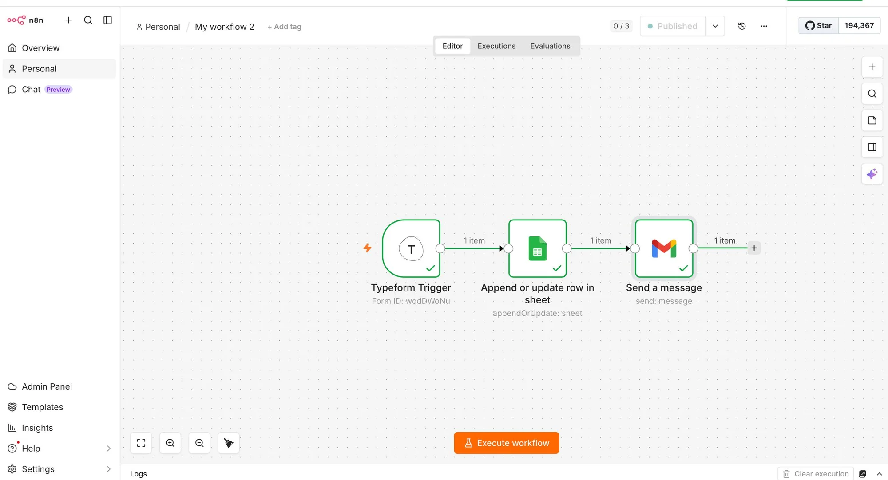

# Lead Capture Automation — Typeform → Google Sheets → Gmail

An end-to-end lead capture workflow built with **n8n** that automatically collects form submissions, stores them in a spreadsheet, and sends instant email notifications.



## What It Does

1. **Typeform** receives a new lead submission (Name, Email, Company)
2. **Google Sheets** stores the lead in a structured spreadsheet row
3. **Gmail** sends an instant notification email with the lead's details

No manual work. Every lead is captured, logged, and alerted — automatically.

## Tech Stack

- [n8n](https://n8n.io) — workflow automation engine
- Typeform — lead capture form
- Google Sheets — data storage
- Gmail — email notifications
- REST API / Webhooks — real-time trigger

## Workflow Overview

```
[Typeform Webhook] → [Google Sheets: Append Row] → [Gmail: Send Notification]
```

### Email notification format

```
Subject: New Lead: {First Name} {Last Name}

🔔 New Lead!

Name:    Dilovar Sam
Email:   dilovar@example.com
Company: Acme Corp
```

## Skills Demonstrated

- Webhook-based real-time triggers
- OAuth2 authentication (Google Sheets + Gmail)
- Dynamic expression mapping between nodes
- No-code workflow design
- End-to-end automation from data capture to notification

## How to Use

1. Import `workflow.json` into your n8n instance
2. Connect your Google Sheets and Gmail credentials
3. Update the Typeform webhook URL
4. Activate the workflow

## About

Built by **Dilovar Sam** — AI & Automation Freelancer
Specializing in n8n, Zapier, Make, and API integrations
📍 Houston, TX | MS Computer Science, North American University
🔗 [Upwork Profile](https://www.upwork.com/freelancers/~dilovarsam)
